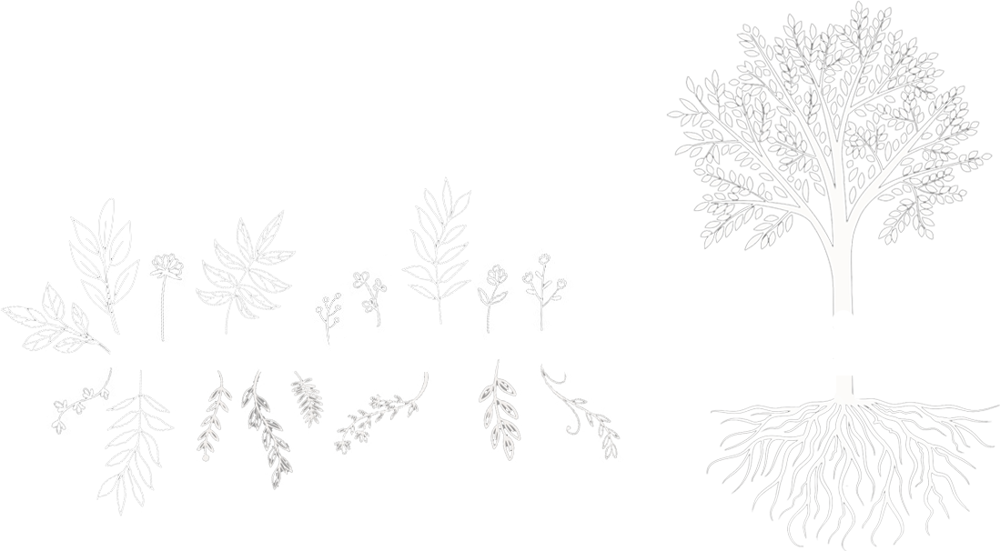

[](https://travis-ci.com/nosachamos/mobx-state-tree-entity)
[](https://codecov.io/gh/nosachamos/mobx-state-tree-entity)

[](https://github.com/prettier/prettier)




Transparent entity management so clean you may never make an api request manually again.

# Installation

```sh
yarn add mobx-state-tree-entity
```

or

```sh
npm install mobx-state-tree-entity --save
```

# WIP

Check back soon. :)
